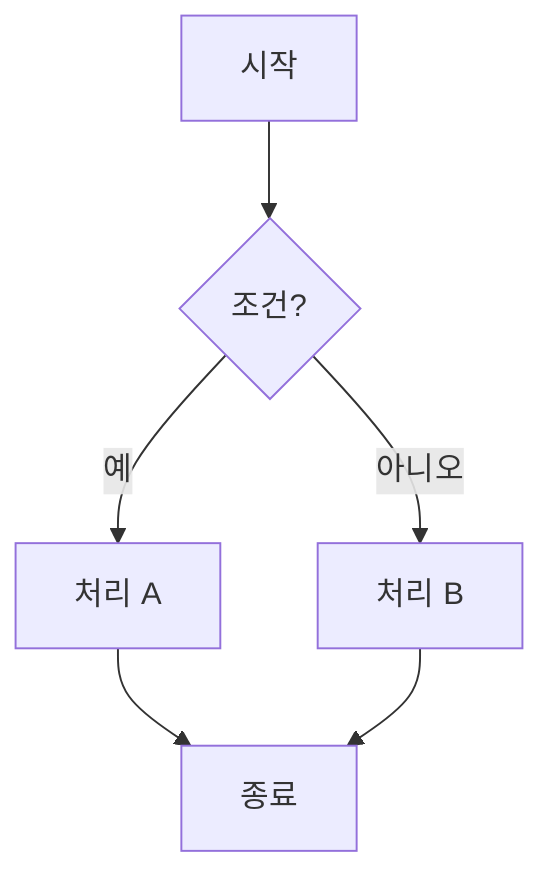
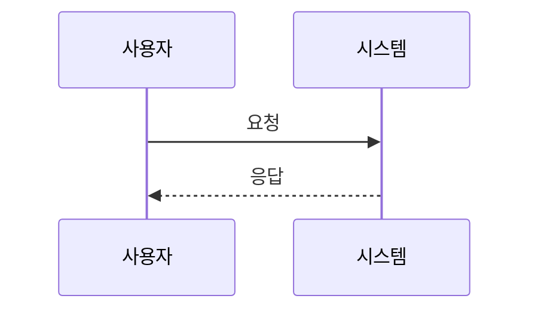

# {주제명} Flow 모음

> Mermaid 다이어그램 코드 원본. overview.md 본문에는 코드를 넣지 않고 여기서 참조한다.
> 복붙용 — 각 Flow는 그대로 복사해 Confluence/FigJam/GitHub에 붙여넣을 수 있다.

---

## Flow 1 — {플로우 이름}

```mermaid
flowchart TD
    A[시작] --> B{조건?}
    B -->|예| C[처리 A]
    B -->|아니오| D[처리 B]
    C --> E[종료]
    D --> E
```

---

## Flow 2 — {플로우 이름}

```mermaid
sequenceDiagram
    participant U as 사용자
    participant S as 시스템
    U->>S: 요청
    S-->>U: 응답
```
